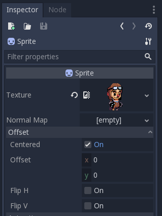
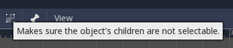

# Sprites og bevegelse

Vi har nå satt opp prosjektet vårt. Og det første vi vil gjøre er å legge til
spillkarakteren, og lage et brett den kan bevege seg på. Vi kommer til å bruke noen
ferdige bilder for dette, disse ligger i `assets`-mappen. Så det første vi gjør er å
kopiere denne mappen inn i prosjektet vårt. 
Dette kan du gjøre med å dra `asset` in i `FileSystem`-området til Godot.

## Lage spillkarakteren

Som nevnt tidligere er alt i GoDot noder, dette betyr at også spillkarakteren vår
vil være en node i godot. Men en typisk sprite i godot består også gjerne av flere
deler. En spillkarakter består gjerne av 1 fysikk-kropp som er noden for karakteren,
og styrer alt av bevegelse og annen fysikk. I tillegg har man gjerne en form for
sprite som barnenode, som styrer visualiseringen - og gjerne en collision-box for
å fange opp kollisjoner. 

La oss starte med å opprette noden for karakteren. Dette kan man gjøre enten ved å klikke
på plusstegnet i scene-manager, eller ved å høyreklikke på "World"-noden og velge
`Add child-node`. Du vil da få opp en oversikt over alle de ulike nodene man har i GoDot.
Vi ønsker en 2D-fysikk-kropp.

For 2D-fysikk er det 3 standard-kropper man kan velge mellom. `CharacterBody2D` som er et
enkelt objekt som kan beveges og har en del ferdige implementasjoner for fysikk allerede
implementert. `RigidBody2D` som er kontrollert av fysikk-motoren i spillet. Dette betyr
at den vil være påvirket av ting som gravitasjon. Det siste er `StaticBody2D`, som bare
er et statisk objekt. Mye brukt til f.eks. å lage spillbrettet. For å finne en bestemt node
kan man enten søke den opp om man kjenner til navnet eller lete litt i treet av ulike noder.

Vi starter med å bruke `CharacterBody2D`, så velg denne og gi den et navn som
indentifiserer at dette er spilleren. Det vil dukke opp en warning om at vi ikke har en
collision-shape og at denne noden ikke kan kollidere med andre noder.
Dette kommer vi til å legge til senere i workshoppen, så ikke tenk på warningen for nå.

Vi ønsker også at spilleren skal være synlig
så vi må legge til en sprite som visualisering. Dette gjør vi ved å lage en node av
typen `Sprite2D` som barnenode til fysikk-noden. Vi må i tillegg gi spriten en tekstur, dette
gjør vi ved å dra ønsket bildefil over i "Texture"-feltet som man finner i inspector på
høyre side når sprite-noden er valgt. 

Vi ønsker å flytte karakteren vår litt inn på spillbrettet. En viktig ting å være klar
over er at posisjonen til barnenoder, er relativt til foreldrenoden. Dette betyr at det
er fysikk-kroppen til spilleren vi vil flytte, og ikke selve spriten, da den vil flytte
seg sammen med kroppen. Dette kan man skru ved å bruke knappen vist i bildet under.

### Få karakteren til å bevege seg

For å få karakteren vår til å bevege seg må vi til med noe kode. Vi må derfor starte
med å koble et script til karakteren vår. Dette kan man gjøre ved å høyreklikke på
fysikk-kroppen til spillkarakteren og velge `Attach script`.

I vinduet du får opp kan du velge templaten: `CharacterBody2D: Basic Movement`. Når
du oppretter filen vil du da få opp en basic implementasjon av movement for en karakter.

Se gjerne litt over koden og se om du forstår hva som skjer. Start gjerne opp spillet
og du vil se at karakteren faller nedover skjermen og kan styres til venstre og høyre.

## Lage en plattform

Å lage en plattform er i stor grad det samme som å lage selve spillkarakteren
den eneste store forskjellen er at vi nå ønsker å bruke `StaticBody2D` i stede 
for `CharacterBody2D` siden plattformene skal være statiske. Lag derfor
en enkel `StaticBody2D` med en sprite som du legger Godot-logoen som tekstur,
og plasser den litt under spillkarakteren. Husk at vi ønsker å flytte
fysikk-kroppen og ikke spriten.

For å lett kunne plassere ting "pixel-perfect" anbefaler jeg å skru på grid-snap. 
(Knappen med ikonet som ser ut som en magnet forran et rutenett). Sett grid-snap
til størrelsen på plattformene (knappen med 3 prikker -> configure snap).

## Implementere kollisjon

Å legge til kollisjon er som alt annet i GoDot, en node. Start med å legge til
en ny barnenode til spillkarakteren av typen `CollisionShape2D`. I inspector
setter man shape til "Rectangle", og sørger for at den passer veldig bra rundt
figuren vår. Gjør tilsvarende for plattformen du har laget.

Om du starter spillet på nytt nå vil du se at karakteren stopper på plattformen,
uten at vi trengte å skrive noe kode.

Dette er en litt tungvinn måte å lage brett på, så for å gjøre dette enklere
skal vi forsøke å lage et brett via [tilemaps og tilesets](./03-tilemaps-og-tilesets.md).

