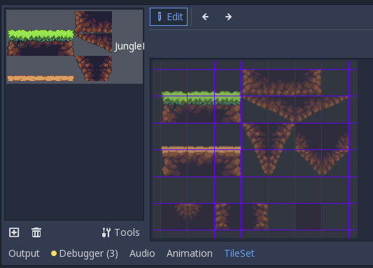
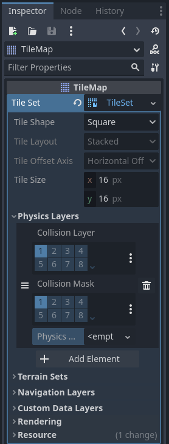
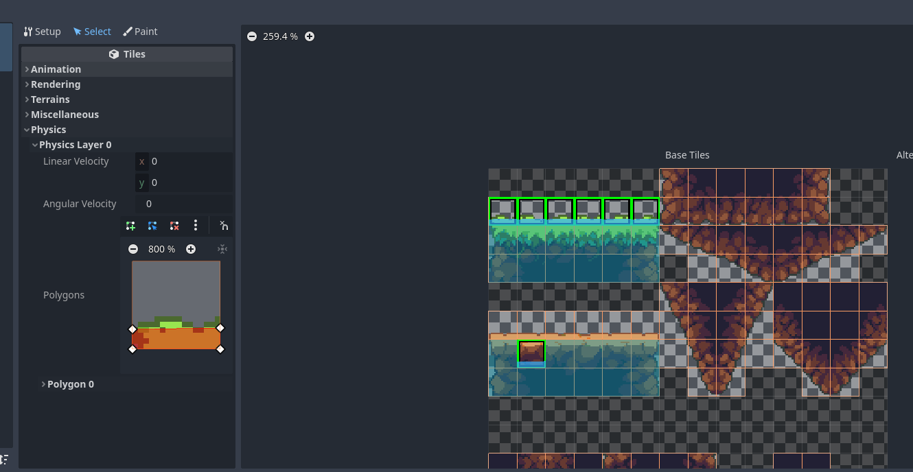

# Tilemaps og Tilesets

Å lage et plattform-spill med bare en logo som plattformer blir fort
ikke så veldig pent. Vi ønsker derfor å bruke et tilemap for å lage et
brett som ser mye mer estetisk pent ut. Filen `assets/Tiles/JungleDirstTileSet.png`
inneholder et sett med sprites som vi kan bruke. Disse spritene kan fint settes
sammen slik at man kan lage kule konstruksjoner.

Disse spritene er hentet fra [Open pixel project](https://www.openpixelproject.com/).

For å kunne gjøre om dette bildet til fungerende plattformer kan man bruke noden
`TileMap`. Et tilemap er en node som holder oversikt over alle "tilesene"
(eller plattformene) i spillet ditt. En tile i en tilemap kommer fra et tileset,
som er en liste utsnitt fra bilder, sammen med kollisjonsboksene deres.

Start med å legge til noden "TileMap" til i spillet ditt. I inspector skal du
da kunne se "TileSet", trykk på denne og velg "new Tileset", og trykk deg 
inn på tilsetet. Du skal da få opp en visning av tilsettet nederst i vinduet.
Dette er nå tomt siden vi enda ikke har laget noen tiles.

Trykk på plusstegnet og velg typen Atlas. Under "Atlas" må du legge inn bildet som en
texture. Trykk på dropdownen, velg load og last inn bildet med TileSettet vi skal bruke.
Den vil forsøke å lage tiles automatisk fra bildet. For vårt bilde skal det være 16x16 med 
ingen mellomrom mellom tiles.

Vi må så sørge for at tilsene våre faktisk har kollisjon, ellers vil figuren bare falle
rett gjennom de. For dette må man legge til noe som heter et physics-layer. Dette finner
du i inspector på høyre side. 

Vi må nå legge til collision-boksen for tilsene våre. Trykk på "TileSet" nederst på skjermen
og velg en av tilsene. Du vil da i menyen til venstre for tilsene finne en "dropdown" med navnet
physics. Under her vil du se en liten knapp med 3 prikker som åpner en meny hvor du kan velge
"reset to default tile shape", denne knappen vil lage en collision-boks som dekker hele tilen.
Du kan da endre den slik at den passer fint med hvor du ønsker at kollisjon skal være for den valgte tilen.

Det blir litt tungvindt å gjøre dette for hver enkel tile. Så for å forenkle det kan du holde
nede shift og markere flere tils samtidig som skal ha samme collision boks og legge den til
for alle på en gang.

Når du er ferdig, dobbeltsjekk at "Cell-size" er satt til 16x16 i inspector
for tilemapet. Sørg også for at grid-snap er skrudd på, og at griden er satt til
16x16. Vi kan nå starte å lage brettet vårt med tilsene. Velg hvilken tile du
ønsker å plassere i menyen og bare trykk på stede du ønsker å plassere de.
Ønsker du å fjerne en tile kan du høyreklikke på den.

Når du er fornøyd med brettet ditt kan du gå videre til
[animasjoner](04-animasjoner.md).