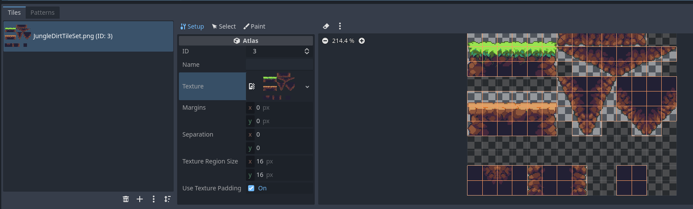

# Tilemaps og Tilesets

Å lage et plattform-spill med bare en logo som plattformer blir fort
ikke så veldig pent. Vi ønsker derfor å bruke et tilemap for å lage et
brett som ser mye mer estetisk pent ut. Filen `assets/Tiles/JungleDirstTileSet.png`
inneholder et sett med sprites som vi kan bruke. Disse spritene kan fint settes
sammen slik at man kan lage kule konstruksjoner.

Disse spritene er hentet fra [Open pixel project](https://www.openpixelproject.com/).

For å kunne gjøre om dette bildet til fungerende plattformer kan man bruke noden
`TileMap`. Et tilemap er en node som holder oversikt over alle "tilesene"
(eller plattformene) i spillet ditt. En tile i en tilemap kommer fra et tileset,
som er en liste utsnitt fra bilder, sammen med kollisjonsboksene deres.

Start med å legge til noden "TileMap" til i spillet ditt. I inspector skal du
da kunne se "TileSet", trykk på denne og velg "new Tileset", og trykk deg 
inn på tilsetet. Du skal da få opp en visning av tilsettet nederst i vinduet.
Dette er nå tomt siden vi enda ikke har laget noen tiles.

Trykk på plusstegnet og last inn bildet vi skal bruke. Du skal da få en visning
som ligner på bildet under.

Vi er nå klare for å starte å opprette tiles. Dette gjøres ved å velge hvilken
region vi ønsker å bruke, og lage en collision-boks som passer til figuren. For
vår bruk vil firkantede kollisjonsbokser fungere helt fint. Men om du ønsker kan
du også legge på litt mer avanserte polygoner for de tilsene med skrå underside.

Bruk knappen "new Single tile", velg hvilken region du ønsker at skal være en
egen tile, og legg til en collision-boks. Gjør dette for de tilsene du ønsker
å bruke.

Når du er ferdig, dobbeltsjekk at "Cell-size" er satt til 32x32 i inspector
for tilemapet. Sørg også for at grid-snap er skrudd på, og at griden er satt til
32x32. Vi kan nå starte å lage brettet vårt med tilsene. Velg hvilken tile du
ønsker å plassere i menyen og bare trykk på stede du ønsker å plassere de.
Ønsker du å fjerne en tile kan du høyreklikke på den.

Når du er fornøyd med brettet ditt kan du gå videre til
[animasjoner](05-animasjoner.md).