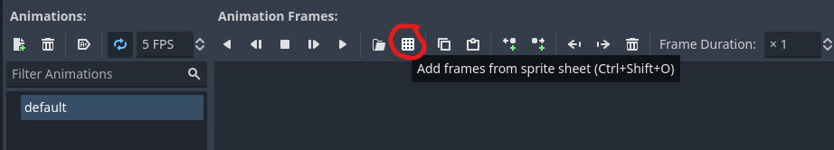
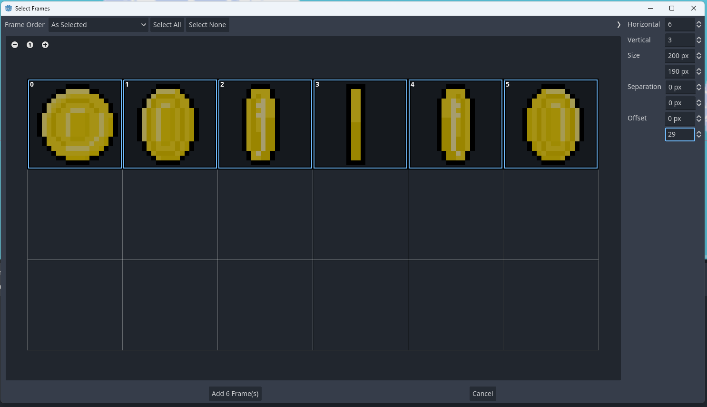
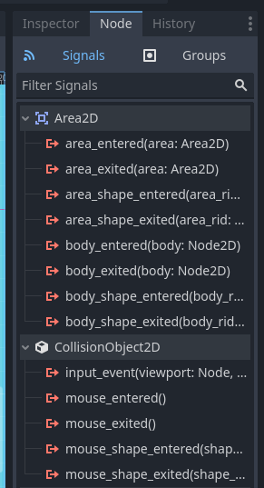
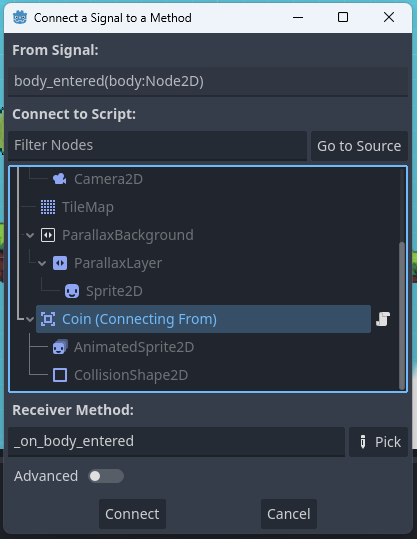

# Collectables

Det neste vi skal gjøre er å legge inn noen mynter som vi kan samle opp og som gir
oss poeng etterhvert som vi samler disse opp. I assets-mappen finner man `gold_coin_sprite_sheet.png`, 
som en en spritesheet som kan brukes til å animere en gullmynt.

Myntene blir på mange måter veldig like som spillkarakteren. De skal ha en animert sprite og en
collision-boks. Men forskjellen er at de ikke skal påvirkes av fysikk og i stede for at figuren
vår kræsjer i den så skal man heller "plukke den opp" og få poeng. For å få til dette kan vi bruke
noe som heter `Area2D` som node for stjernen, som er type som kan kollideres med men som ikke er
et objekt med fysikk. Under denne legger vi til en `AniomatedSprite2D`. Men her er det en liten
forskjell siden vi nå skal bruke en sprite-sheet (et stort bilde som egentlig er en samling av
flere mindre bilder) må vi importere den som en sprite sheet via "Add frames from sprite sheet".



Du vil nå få opp et vindu hvor du ser hele bildet. Det vi trenger nå er å hjelpe GoDot med å
fortelle den hvordan spritesheeten er delt, slik at den kan forstår hva som er ulike deler
av animasjonen. Juster tallene i menyen til høyre slik at hver mynt passer perfekt i hver sin rute
og velg de rutene som skal være en del av animasjonen.



Mynten blir veldig svær, så det kan være en greit å gjøre den mindre. Dette gjør man via å justere
scale under "Node2D -> Transform -> scale" i inspector når man har valg spriten. Etter du har fått
den til en størrelse du liker kan du plassere den på grei plass. Husk at du ønsker å flytte
"rot-noden" til mynten og ikke bare spriten.

Om du starter spillet nå vil du se at mynten er der du plasserte den, men den er ikke animert.
Dette er fordi vi ikke har sagt at vi ønsker å starte noen animasjon - for å få til dette må vi
legge til et script på selve mynten (via attach script) og i `_ready` funksjonen legge til
kode som starter selve animasjonen. Vi kan spille av animasjonen ved å bruke `$AnimatedSprite2D.play()`.

Nå har vi en mynt som spinner, men vi kan ikke plukke den opp siden vi ikke har en collision-boks
på den. Vi må altså legge til en `CollisionShape2D` og gi den en shape som passer med selve mynten.
Siden mynten er rundt kan man f.eks. bruke en `CircleShape` som passer perfekt med den. 

Vi må nå sørge for at vi faktisk fjerner mynten og gir spilleren poeng når de kolliderer med den.
For dette bruker vi noe som heter [signals](https://docs.godotengine.org/en/stable/getting_started/step_by_step/signals.html).
Signals er GoDot sin måte å gjøre events på - og hvordan man varsle ulike noder om ting som skjer.
F.eks. i dette tilfelle trenger vi et mynten lytter på at spilleren kolliderer med den. Når dette
skjer ønsker vi at den sender et signal om at den har blitt plukket opp som spilleren kan lytte etter. I tillegg ønsker vi å fjerne mynten.

Vi starter med å legge til at vi ønsker å flytte på signalet "body_entered" for mynten vår. Dette
gjør vi ved å vele mynten og velge "node" i stede for inspector på høyre siden og dobbeltklikke på 
det signalet vi vil lytte på. 



Vi må nå velge i hvilket script vi ønsker at funksjonen som blir kalt skal leve. Vi ønsker
at metoden skal ligge på mynten sitt script - så vi velger å bare connecte den til seg selv.



Vi får nå opp en funksjon som vil bli kalt når vi får et signal om at en "body" kolliderer med
mynten vår. Vi trenger nå å fjerne mynten når dette skjer - noe vi kan gjøre via `self.queue_free()`
som fjerner en node fra spillet.


## Poeng

Vi ønsker nå å sørge for å sende et signal til spilleren om at mynten er blitt plukket opp og øke
antall poeng spilleren har. For å få til dette trenger vi noe som heter et 
[Heads up display](https://docs.godotengine.org/en/stable/getting_started/first_2d_game/06.heads_up_display.html) 
hvor vi kan vise ting til brukeren som ikke er en del av selve "verden".
For å lage dette lager vi først en ny node av typen `CanvasLayer` som et ett eget lag som tegnes
for seg selv. Kall denne f.eks. "HUD" eller tilsvarende. På denne ønsker vi å legge til en label
som skal vise scoren vår. Det kan også være lurt å legge til en ny "LabelSettings" på denne labelen
hvor du kan få mye større kontroll på fonten som brukes.

Vi trenger en måte å holde styr på hvor mange poeng brukeren har, og ha en måte å oppdatere dette på.
Til dette kan man bruke "Singletons", som blir globale variabler for å holde på state. 
Gå til "Project -> Project Settings -> Autoload" og add en ny node med navnet "Score". Den vil da
lage et nytt script for deg som vil bli en global "scene" som er tilgjengelig over alt i koden
til spillet. Her ønsker vi å ha en public variabel som eksponerer scoren vår, 
samt en funksjon for å oppdatere den. Dette kan vi gjøre ved å legge til følgende kode:

```
@export var score = 0

func add_score(points: int):
	score += points
```

Siden vi kalte denne Singletonen for `Score` kan vi nå akksessere disse via `Score.add_score` og `Score.score`. 
Vi trenger nå å gå tilbake til scriptet til mynten vår og oppdatere den så den
øker scoren vår når mynten blir plukket opp. I tillegg må vi gjøre slik at HUDen vår oppdaterer
teksten i labelen til å stemme med vår nåværende poengsum. Til dette kan vi f.eks. bruke `_process`
funksjonen som blir kalt hver frame. Vi kan f.eks. legge til en kodelinje der som oppdaterer teksten
på labelen.


## Flere mynter

Man kan egentlig copy-paste mynten flere ganger om man ønsker, og ting burde fungere. Men når man
slike ting man vi gjenbruke er det beste å gjøre det til en "scene", som kan brukes som en komponent.
Høyreklikk på mynten i menyen til venstre og velg "Save branch as scene", og lagre den på en egnet
pass. Du har nå en gjenbrukbar komponent. Du kan gjerne kopiere og plassere ut flere av denne.

Det neste blir å [legge til flere brett](07-flere-brett.md).
