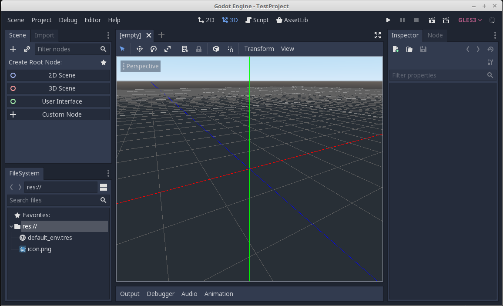
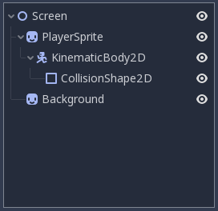
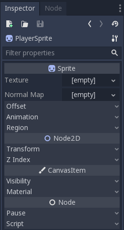

# Introduksjon til Godot

I denne workshopen skal vi gå til en liten introduksjon til spillmotoren Godot. Vi vil gjennom oppgavene lage vårt eget
lille 2D-plattform spill, med støtte for å enkelt utvide med flere brett om ønskelig. Workshopen er delt opp i flere
oppgaver - men hver enkelt oppgave bygger på den forrige. Så det anbefales sterkt at man går gjennom alle oppgavene.

Selve repoet inneholder ikke noe kode, og tanken er at man starter helt fra scratch med et tomt prosjekt - og gjennom
å følge oppgavene ender opp med et ferdig spill. Vi vil bruke noen diverse bilder i workshopen, disse ligger i mappen
`assets` - og det vil komme frem i oppgavene når du skal bruke dem.

## Komme i gang

Det første vi skal gjøre er å laste ned Godot og sette opp prosjektet vårt. Godot kan lastes ned gjennom
[deres nettsider](https://godotengine.org/download). Du vil her få opp 2 alternativer *Standard version* og
*Mono version*. Forskjellen mellom disse er kun at Mono-versjonen støtter C#. Men for å støtte C# må man ha mono
som krever *MSBuild*. I denne workshopen kommer vi til å bruke GDScript - som et et programmeringsspråk som ligner
veldig på python. Vi trenger derfor ikke *Mono version*.

Når du starter opp Godot vil du bli møtt av *Project manager*. Vi ønsker her å starte et nytt prosjekt. Vi kan da velge
mellom *OpenGL ES 3.0* og *OpenGL ES 2.0*. Det har ikke så mye å si hvilken man velger - eneste som er greit å være klar
over er at ES 2.0 er betydelig bedre støttet om man ønsker at spillet skal kjøre i nettleseren.

Når du har laget prosjektet vil du bli møtt av en editor med en 3D-visning i midten. Siden vi i førsteomgang skal
lage et 2D spill ønsker vi å bruke 2D-visningen. Trykk på knappen "2D" som du finner øverst i midten på siden for
å endre perspektiv.

Skjermbilde består av 4 deler som det er viktig å bli komfortabel med når man bruker Godot. Det første oppe til venstre
er der vi vil kontrollere nodene i spillet vårt. I Godot er alle objekter en node som ligger i et hieraki. En node kan
har gjerne noen properties som kan konfigureres. I tillegg har den gjerne barnenoder. Man kan også knytte script til
en bestemt node. På mange måter en en node et objekt i objekt-orientert programmering. Og typen node vil da være hvilken
klasse den er en instans av.

*Root-node* kalles en *Scene*, og skal være en enkeltstående enhet. I mange tilfeller er den også gjenbrukbar. Under en
scene kan man legge flere noder som tilhører scenen. I eksempelet under har det blitt laget en node for bakgrunnen og
en sprite-node for spilleren. Spilleren har da en undernode som implementerer 2D-fysikk - som igjen har en undernode
som beskriver kollisjonsboksen. Disse 3 tingene til sammen gjør at man har en *Sprite* som kan beveget på, som
bruker enkel fysikk og kan kollidere med andre noder.

Det over ble veldig overordnet, så ikke vær redd om det var litt forvirrende. Vi blir å se met detaljert på alt utover
i workshopen.

Nede til venstre finner du filsystemet. Som egentlig ikke krever ytterligere forklaring. Til høyre finner du *inspector*.
Dette er steder hvor du kan endre konfigurasjonen til et valgt node. Du kan også sette opp *signaler* som er det Godot
kaller det event-drevne systemet sitt. (f.eks. kan du lage et signal for når en kollisjon skjer, eller man trykker på en
knapp).

